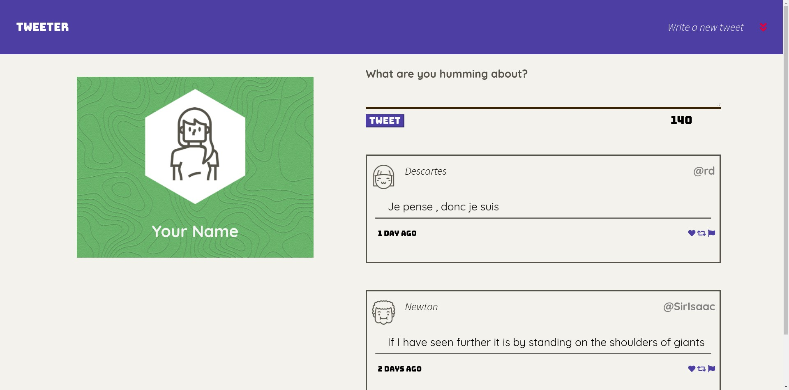
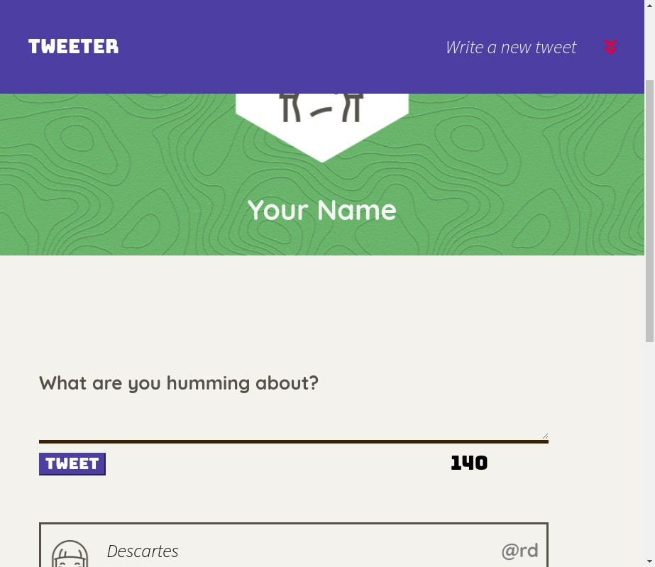

# Tweeter Project

Tweeter is a simple, single-page Twitter clone.

This repository has the starter code for the project. You can see my front-end contributions in the files above. Watch it in action [here!](https://watch.screencastify.com/v/SLxiGpOEmGezvlaqtM2a)

##
##

## Getting Started

1. Fork this repository, then clone your fork of this repository.
2. Install dependencies using the `npm install` command.
3. Start the web server using the `npm run local` command. The app will be served at <http://localhost:8080/>.
4. Go to <http://localhost:8080/> in your browser.

## Dependencies

- Express
- Node 5.10.x or above

##Stack
- HTML
- CSS
- JS
- jQuery
- AJAX
